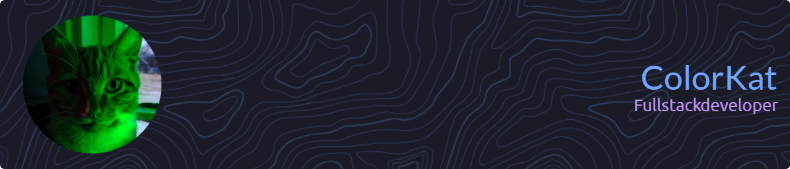

### 🦾About me

I’m a fullstack web developer with over 7 years of experience. 

Previously, I was a Software Engineer at Yandex, working on the Delivery Frontend Infrastructure for B2B products.

Currently, I am the Founder of **Pomelo — Food Analyzer**, where I act as the main developer and Tech Lead. I design the system architecture, build and maintain the entire infrastructure, and working on the product end-to-end. I lead the development team, conduct code reviews, make key technical decisions, and handle hiring, product development, and marketing — wearing all the hats typical for an startups :)

At the same time, I’m actively take part in hackathons. In 2025 my team and I have won 3 hackathons!

I’m passionate about designing the architecture of large highly loaded applications and writing clean, scalable code. Currently. I have a strong background in mathematics, which helps me solve complex problems and optimize solutions.

Telegram: `@ColorKat`
Email: `rogov.vladislavx@gmail.com`

&nbsp

### 🎓My Awesome Stats

### 🏆My Github Trophy

